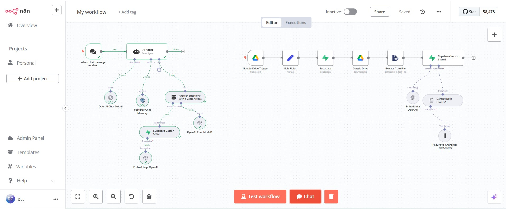
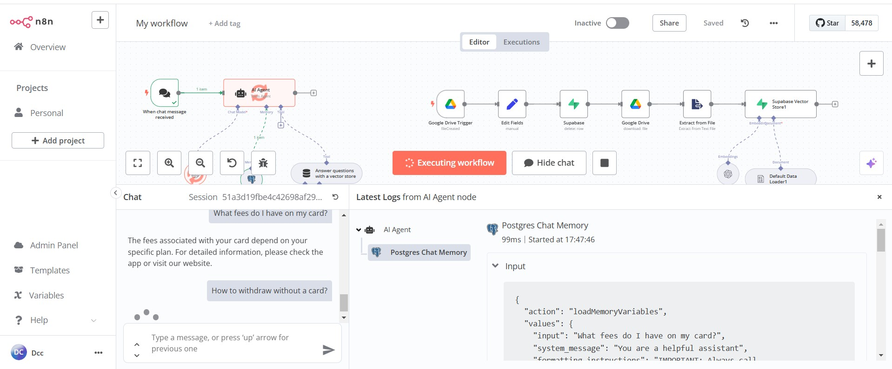

# 🚀 Creating an AI RAG Agent in n8n

This repository contains a detailed tutorial for building an AI RAG (Retrieval-Augmented Generation) Agent in n8n, capable of answering questions based on documents stored in a vector database.



## 📌 Objective

Create an AI agent that can answer questions based on stored documents using **GPT-4o mini** from OpenAI, **PostgreSQL** for memory, and **Supabase Vector Store** for vector storage.

## 🛠️ Technologies Used

- **n8n** - Automation platform  
- **OpenAI GPT-4o mini** - AI model  
- **PostgreSQL** - AI agent memory  
- **Supabase Vector Store** - Vector storage  
- **Google Drive** - Document upload  

## 🔗 Integration of Tools

The AI agent workflow involves:

1. Connecting **OpenAI's API** to **PostgreSQL** and **Supabase Vector Store**  
2. Configuring the AI agent's memory in **PostgreSQL**  
3. Storing documents in **Supabase Vector Store**  
4. Creating a **Google Drive trigger** to capture new documents  
5. Processing files and generating embeddings with **OpenAI**  
6. Using **n8n** to manage the data flow  

The test documents contain fictional questions and answers for a virtual Customer Support assistant, generated by **ChatGPT**.

---

## 📖 Step-by-Step Guide

### 1️⃣ Creating the AI Agent in n8n

- Add a **message trigger**  
- Use the node **"Advanced AI / AI Agent"**  
- The AI agent will respond and decide when to consult the database  
- Configure the **"AI Agent"**  
  - **Chat Model**: Create OpenAI credentials  
  - **Memory**: Choose PostgreSQL (using Supabase)  

### 2️⃣ Setting Up Supabase

- Create a new project in **Supabase** (e.g., `n8n AI Agent - Date - DEMO Z`)  
- Set a password for the database  
- Ensure the project is active (**Check Project Status**)  
- Go to **Project Settings > Database > Connection Parameters**  

### 3️⃣ Configuring PostgreSQL in n8n

- Create a new **PostgreSQL credential** in n8n  
- Configure the parameters:  
  - **Host, Port, User, Password** (obtained from Supabase)  

### 4️⃣ Setting Up the Vector Store Tool

- Add the **vector storage tool**  
- Name and description  
- Select **Supabase Vector Store**  
- Connect to the Supabase account (**Project Settings > API**)  
- Copy **URL and secret key** into n8n  
- Create the **storage table**  
- In **Supabase SQL Editor**, run the script from n8n documentation (**Quickstart for setting up your vector store**)  
- Choose **Table Name**: `documents`  
- Add option: `match_documents`  

### 5️⃣ Uploading and Processing Documents

- Create a folder in **Google Drive**  
- In **n8n**, add a trigger **"Google Drive - On Changes on Specific Folder"**  
- Select event: **When a document is created**  
- Upload documents to the **Google Drive folder**  
- Run **"Fetch Test Event"** in n8n to verify document detection  

### 6️⃣ Processing the Files

- Convert the document to a processable format  
  - **Google File Conversion**: TXT to CSV  
- Download the document  
  - **Google Drive - Download File by ID**  
- Transform the file  
  - **Data Transformation**: Extract from text file  
- Ensure no duplicates in **Supabase**  
  - Delete previous records in **Supabase Vector Store**  
  - Set a filter to prevent duplication:  
    ```sql
    metadata->>file_id=like.*{{$json.id}}*
    ```

### 7️⃣ Creating Embeddings in Supabase Vector Store

- Add **OpenAI embeddings**  
- Define **chunk size and overlap** for document splitting  
- Use the **"Recursive Character Test"** model  
- Save settings and test agent queries  




---

## 📌 Final Considerations

Your **AI agent** is now ready to answer questions based on stored documents! 🚀  
It can retrieve information from the **vector database** and generate intelligent responses using the **GPT-4o mini** model.  

If you need assistance or want to contribute, feel free to **open an issue** or **submit a pull request**!  
